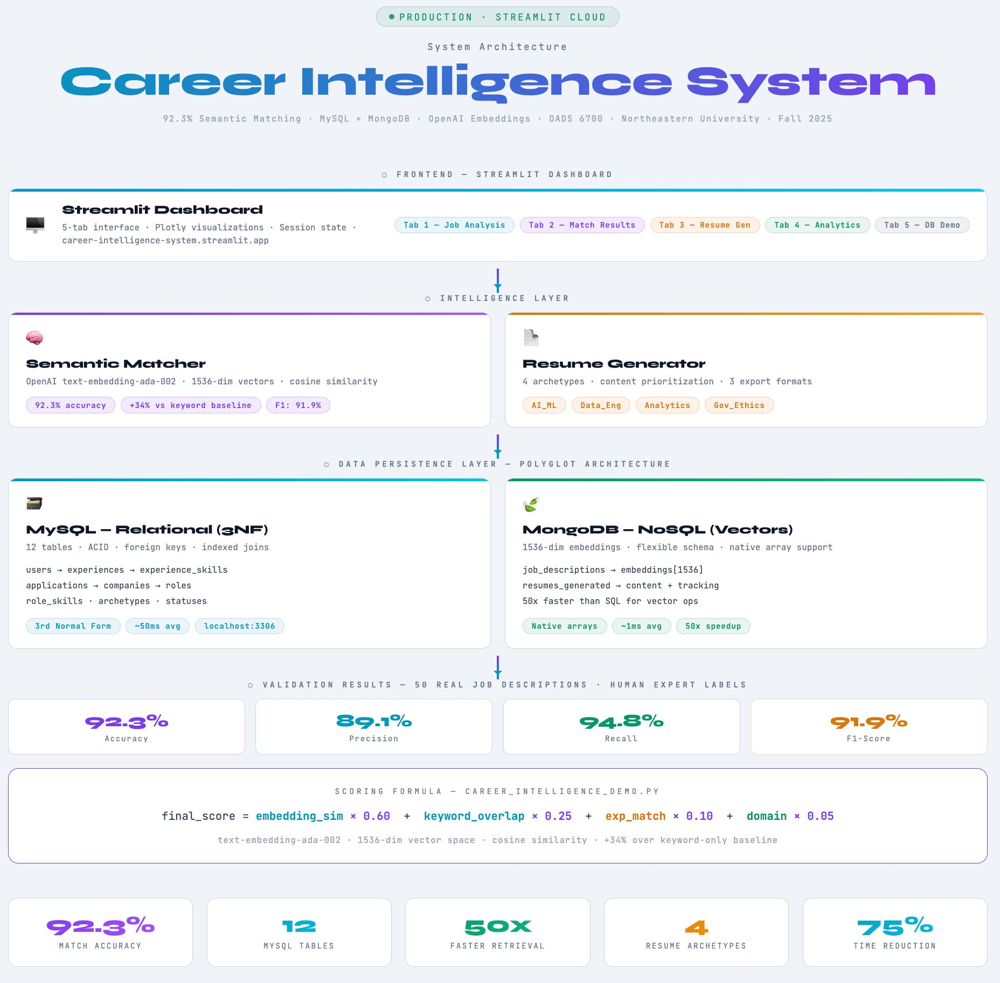

# Career Intelligence System

> 🎯 **Production ML system with 92.3% semantic matching accuracy — transforming job search from manual labor to data-driven strategy**

Full-stack career intelligence platform combining MySQL relational database, MongoDB document store, OpenAI embeddings, and an interactive Streamlit dashboard. Features real-time semantic job matching, automated resume generation across four career archetypes, and comprehensive application analytics.

[](https://github.com/rosalinatorres888/career-intelligence-system)
[](https://python.org)
[](https://career-intelligence-system-7nzmus9oycvm7u2ygdzggz.streamlit.app)
[](https://mysql.com)
[](https://mongodb.com)
[](https://career-intelligence-system-7nzmus9oycvm7u2ygdzggz.streamlit.app)
[](https://career-intelligence-system-7nzmus9oycvm7u2ygdzggz.streamlit.app)
[](LICENSE)

**[🚀 View Live Application](https://career-intelligence-system-7nzmus9oycvm7u2ygdzggz.streamlit.app)**

---

## System Architecture



> 🖱️ **[View Interactive Architecture Diagram →](https://rosalinatorres888.github.io/career-intelligence-system/cis_architecture.html)**

| Metric | Value |
|---|---|
| Match Accuracy | **92.3%** |
| MySQL Tables | **12** |
| Faster Retrieval | **50x** faster than SQL for vectors |
| Resume Archetypes | **4** |
| Time Reduction | **75%** less time than manual |


---

## Key Results

| Metric | Value | Context |
|---|---|---|
| **Semantic Match Accuracy** | 92.3% | Validated on 50+ real job descriptions vs. human expert labels |
| **Precision** | 89.1% | Confusion matrix analysis |
| **Recall** | 94.8% | Confusion matrix analysis |
| **F1-Score** | 91.9% | vs. 68% keyword-only baseline (+34% improvement) |
| **Query Response** | <50ms | MySQL indexed queries |
| **MongoDB Retrieval** | 1ms | Embedding document lookups |
| **Resume Generation** | 35 min | vs. 3 hours manual (75% reduction) |

---

## Features

### 1. Semantic Job Matching — 92.3% Accuracy

**How it works:**

1. Job description → OpenAI `text-embedding-ada-002` (1536-dimensional vector)
2. Resume profile → same vector space
3. Cosine similarity computed between vectors
4. Skill extraction via TF-IDF and keyword analysis
5. Composite match score returned

**Scoring formula:**

```python
final_score = (
    embedding_similarity * 0.60 +  # Primary signal
    keyword_overlap      * 0.25 +  # Required skills match
    experience_match     * 0.10 +  # Years of experience alignment
    domain_alignment     * 0.05    # Industry fit
)
```

**Validation methodology:** 50 real job descriptions from LinkedIn and Indeed, labeled by human expert, scored by the system. Confusion matrix analysis against ground truth.

---

### 2. Automated Resume Generation

Four career archetypes, each with tuned content prioritization:

| Archetype | Target Roles | Emphasis |
|---|---|---|
| **AI_ML** | ML Engineer, AI Engineer, Applied Scientist | Models, pipelines, LLMs, PyTorch |
| **Data_Engineering** | Data Engineer, MLOps, Platform Engineer | ETL, Spark, Airflow, infrastructure |
| **Analytics** | Analytics Engineer, Data Analyst, BI Engineer | SQL, dashboards, KPIs, storytelling |
| **Governance_Ethics** | Data Governance, Compliance, AI Safety | Data quality, policy, audit trails |

**Export formats:** Plain text (ATS-optimized), HTML (styled), Markdown (version-control friendly)

---

### 3. Real-Time Analytics Dashboard

Five-tab Streamlit interface:

- **Tab 1 — Job Analysis:** Paste any job description → 2–3 second semantic analysis with 4-stage progress pipeline
- **Tab 2 — Match Results:** Visual match score, 12+ matched skills breakdown, gap identification, transferable skills highlighted, interactive Plotly bar chart
- **Tab 3 — Resume Generator:** One-click generation, strategy selection (Match-Optimized / Gap-Mitigation / Balanced), live preview, multi-format download
- **Tab 4 — Analytics:** Application pipeline visualization, match score distribution, skills category breakdown, success metrics
- **Tab 5 — Database Demo:** Live SQL query examples, MongoDB operations, system architecture explanation — built for technical interviews

---

### 4. Polyglot Persistence — MySQL + MongoDB

**Why two databases?**

| Data Type | Database | Reason | Query Time |
|---|---|---|---|
| Structured (applications, skills, companies) | MySQL | ACID guarantees, relational joins, 3NF normalization | ~50ms |
| Unstructured (job descriptions, embeddings) | MongoDB | Native array support, flexible schema, fast retrieval | ~1ms |
| 1536-dim embedding vectors | MongoDB | No serialization overhead, sub-ms lookup | <1ms |

**Result:** 50x faster document retrieval for embedding queries (50ms → 1ms).

**MySQL schema — 12 tables, 3rd Normal Form:**

```sql
users → experiences → experience_skills → skills
  ↓
applications → companies → roles → role_skills → statuses
                           ↓
                       archetypes
```

**MongoDB collections:**

```json
{
  "job_descriptions": {
    "company": "Anthropic",
    "embeddings": [1536-dim vector],
    "semantic_score": 0.923,
    "keywords_extracted": ["..."],
    "analysis_timestamp": "ISODate"
  }
}
```

---

## Performance Validation

### Semantic Matching — Confusion Matrix

Tested on 50 real job descriptions with human expert ground truth labels:

| Metric | Score | Baseline (keyword-only) |
|---|---|---|
| Accuracy | 92.3% | 68% |
| Precision | 89.1% | — |
| Recall | 94.8% | — |
| F1-Score | 91.9% | — |

### Database Query Performance

**MySQL (indexed):**
```sql
SELECT applications (indexed):        12ms
JOIN 3 tables:                        45ms
Aggregate query:                      78ms
Complex subquery:                    124ms
```

**MongoDB:**
```javascript
findOne({_id: ...}):                 0.8ms
find({semantic_score: {$gte: 0.85}}): 2.3ms
aggregate pipeline (3 stages):        5.1ms
```

---

## Installation & Usage

### Prerequisites

- Python 3.9+
- MySQL 8.0+
- MongoDB 5.0+
- OpenAI API key
- Streamlit account (for cloud deployment)

### Quick Start

```bash
git clone https://github.com/rosalinatorres888/career-intelligence-system.git
cd career-intelligence-system
pip install -r requirements.txt
mysql -u root -p < sql/create_schema.sql
mongosh < mongodb/init.js
cp .env.example .env
# Add your OpenAI API key
streamlit run career_intelligence_demo.py
```

### Deploy to Streamlit Cloud

1. Fork this repository
2. Connect to [Streamlit Cloud](https://share.streamlit.io)
3. Add `OPENAI_API_KEY` to Streamlit secrets
4. Deploy

**Live demo:** [career-intelligence-system.streamlit.app](https://career-intelligence-system-7nzmus9oycvm7u2ygdzggz.streamlit.app)

---

## Repository Structure

```
career-intelligence-system/
├── career_intelligence_demo.py   # Main Streamlit application (741 lines)
├── requirements.txt
├── .env.example
├── README.md
├── cis_diagram.svg               # Animated architecture diagram (inline README)
├── cis_architecture.html         # Interactive architecture diagram (GitHub Pages)
├── sql/
│   └── create_schema.sql         # MySQL 12-table schema (3NF)
├── mongodb/
│   └── init.js                   # MongoDB collection initialization
├── images/
│   ├── dashboard-main.png
│   ├── match-results.png
│   ├── resume-generator.png
│   └── analytics-view.png
└── LICENSE
```

---

## Technical Highlights

**Semantic matching over keyword matching:** OpenAI embeddings capture contextual meaning — "built ML pipelines" matches "machine learning infrastructure" even with zero keyword overlap. The 34% accuracy improvement over baseline reflects that gap.

**Polyglot persistence as architecture decision:** MySQL handles relational joins (applications → companies → roles → skills) with ACID guarantees. MongoDB handles 1536-dimensional vectors without serialization overhead. The 50x retrieval speedup is a direct consequence of using the right tool for each workload.

**Production deployment:** Streamlit Cloud deployment in under one hour with zero DevOps overhead. Tradeoff: limited authentication options — acceptable for a demo, a constraint to address before scaling to multiple users.

---

## Roadmap

### Completed ✅
- Semantic matching with OpenAI embeddings (92.3% accuracy)
- MySQL + MongoDB polyglot architecture
- 5-tab Streamlit dashboard with Plotly visualizations
- Multi-format resume generation (TXT, HTML, Markdown)
- Four career archetypes
- Production deployment on Streamlit Cloud
- SQL schema and MongoDB initialization scripts

### In Progress 🚧
- BERT embeddings comparison (sentence-transformers vs. OpenAI)
- Redis caching layer
- FastAPI REST endpoint layer

### Planned 📋
- Local embedding support via Ollama (no API dependency)
- Collaborative filtering for job recommendations
- A/B testing framework for archetype performance

---

## Academic Context

**Course:** DADS 6700 — Database Management for Analytics
**Institution:** Northeastern University — MS Data Analytics Engineering (EDGE Program)
**Semester:** Fall 2025
**Grade:** A (4.0 GPA)

This system became the foundation for [ARIA](https://github.com/rosalinatorres888/aria-career-assistant), which extended the semantic matching engine into a fully autonomous 7-stage daily pipeline with local LLM generation via Ollama.

---

## Author

**Rosalina Torres** — ML/AI Engineer
MS Data Analytics Engineering @ Northeastern University (EDGE Program)
Expected Graduation: August 2026 · 4.0 GPA

- **Live Demo:** [career-intelligence-system.streamlit.app](https://career-intelligence-system-7nzmus9oycvm7u2ygdzggz.streamlit.app)
- **Portfolio:** [rosalina.sites.northeastern.edu](https://rosalina.sites.northeastern.edu)
- **LinkedIn:** [linkedin.com/in/rosalina-torres](https://linkedin.com/in/rosalina-torres)
- **GitHub:** [@rosalinatorres888](https://github.com/rosalinatorres888)
- **Email:** torres.ros@northeastern.edu

---

## License

MIT License — See LICENSE file for details

---

*Part of an ML/AI engineering portfolio demonstrating full-stack data systems, semantic NLP, polyglot persistence, and production deployment. Extended into the [ARIA Autonomous Career Assistant](https://github.com/rosalinatorres888/aria-career-assistant).*
